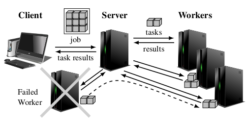
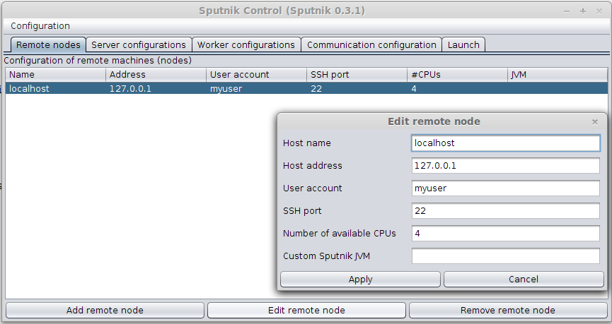
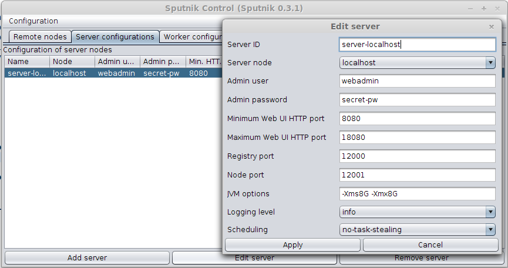
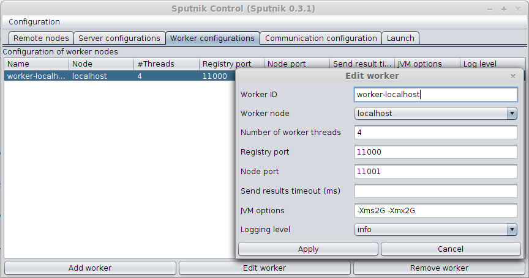
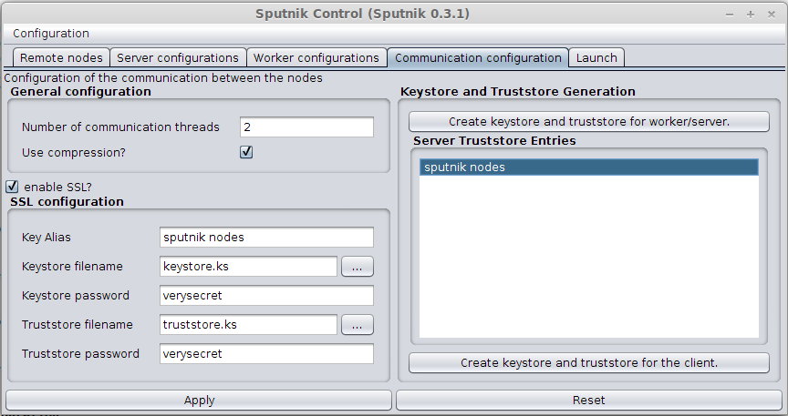
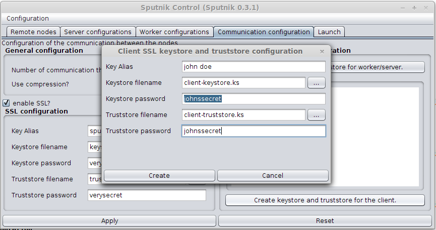
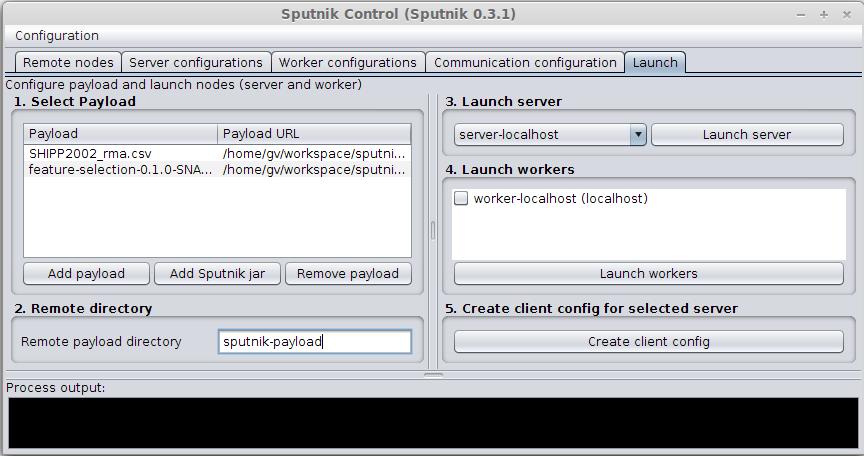
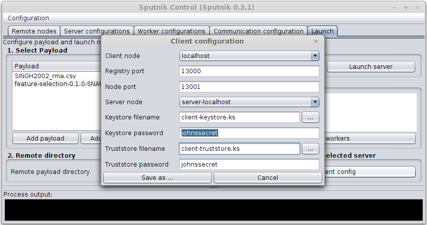

# Configuration and Deployment

The distributed computation scenario that Sputnik uses consists of three roles (see below): client, worker and server.
The client submits a job (= a collection of tasks) to the server.
The server distributes the tasks to the available worker nodes.
On completion the tasks are sent back to the server.
For the deployment of all needed files Sputnik uses [SSH](http://en.wikipedia.org/wiki/Secure_Shell) via the [pallet](http://palletops.com/) library.

<p align="center">

<br>
Distributed computation scenario of Sputnik.
<br>
(Image: Copyright © 2014 Gunnar Völkel. All rights reserved.)
</p>

The graphical user interface for the configuration of Sputnik can be started with the following command.
```bash
$ java -jar sputnik-<VERSION>.jar control-gui
```

This document explains the individual configuration options and is organized as follows.

**Topics**
* [Available Nodes](#available-nodes)
* [Server Configurations](#server-configurations)
* [Worker Configurations](#worker-configurations)
* [Communication Configuration](#communication-configuration)
* [Deployment](#deployment)


## Available Nodes

The tab *Remote nodes* is used to specify all available computation nodes that can be used as client, worker or server.
For each node at least a host name, host address and an existing user name is need.
The host name is only used as nickname to identify the node.
The user name must be a valid user account on the node that is allowed to login via SSH.

In case the node uses a non-standard SSH port the port can be specified.
The number of available CPUs is used to determine the number of worker threads if that number is not specified for a worker.

It is possible to install a custom Java Runtime Environment (JRE), e.g. in the home directory of the user.
The path of the ```java``` binary must be specified under *Custom Sputnik JVM*, e.g. ```/home/myuser/jdk8/bin/java```.
<p align="center">

</p>


## Server Configurations

The tab *Server configurations* is used to specify the additional properties a server node needs.
The *Server ID* is used to identify the server throughout the configuration.
A server needs at least an associated node, a registry port and node port.
The default ports do not need to be changed unless they are already used on the target node or a port forwarding scenario is used.
Additional options can be specified for the JVM can be specified. In the screenshot below the memory of the JVM is limited to 8 GB.
One of the predefined scheduling strategies can be chosen.

The *admin user* and *admin password* are used to login to the web user interface.
The server uses the minimum unused port in the given range of ports for the webserver that runs the web user interface,
e.g. when port ```8080``` has been configured as minimum port and this port is unused on the server ```server.mydomain.org```
the web user interface will run on ```http://server.mydomain.org:8080``` after launching the server. 

<p align="center">

</p>


## Worker Configurations

The tab *Worker configurations* is used to specify the additional properties a worker node needs.
The *Worker ID* is used to identify the worker throughout the configuration.
A worker needs at least an associated node, a registry port and node port.
The default ports do not need to be changed unless they are already used on the target node or a port forwarding scenario is used.
The *number of worker threads* can be specified.
This number is used when the worker starts but can be modified via the web user interface of the server.
Additional JVM options can be specified for the worker as well.
The *send result timeout* specifies how long the worker waits for finished tasks before these tasks are sent back in one message to the server.

<p align="center">

</p>


## Communication Configuration

The tab *Communication configuration* allows to specify the details for the used communication between the nodes.
When enabled SSL is used for secure communication.
Sputnik nodes enforce client authentication for SSL connections, i.e. only nodes that are listed in the truststore of node are allowed to connect to it.


### General configuration

Communication between Sputnik nodes is asynchronous and several threads can be used to process received messages.
Messages can be compressed as well.

### SSL configuration

When SSL usage is enabled (which is recommended) this section specifies the needed keystores and passwords for the server and the workers.
The key alias identifies the private key and certificate of the server/workers when stored in a keystore.
The keystore contains the private data (private key and certificate) while the truststore contains an entry per trusted certificate.
Both stores are encrypted with the specified passwords, respectively.

### Keystore and truststore generation

The button *Create keystore and truststore for worker/server* triggers the generation of a new private key and certificate which are then
stored in a keystore and truststore combination such that workers are able to connect to the server and vice versa.

<p align="center">

</p>

### Keystore and truststore for clients

The button *Create keystore and truststore for the client* triggers the generation of a new private key and certificate for a client.
The client certificate is added to the truststore of the server so that the client is allowed to connect to the server.
Similarly, the client trusts the server. 

<p align="center">

</p>


## Deployment

This section describes the deployment of server and worker nodes.
**For successful deployment you need to setup and use [key-based SSH authentication](SSH.md)!** 

The following four steps are needed for deployment.

1. **Select payload:** Choose the files that need to be uploaded to the server/workers.
  At least a jar containing the Sputnik implementation and the code for the computation must be uploaded.
  When the Sputnik GUI is run separately it is possible to add its jar automatically via *Add Sputnik jar*.
2. **Remote directory:** Specify the name for the directory on the server/workers.
  This directory will be created or overwriten automatically on deployment. All payload files are copied to that directory.
3. **Launch server:** Deploys the payload and launches the server. A dialog will notify you when the deployment was completed.
4. **Launch workers:** Deploys the payload and launches the workers that are selected in the list above.

<p align="center">

</p>

### Manual restarts

In case one of the nodes (server or worker) crashes it can be easily restarted without a complete redeployment.
Sputnik generates a bash script ```start-<NODENAME>-<ROLE>.sh``` (```<ROLE>``` is either ```server``` or ```worker```)
for each node which is used for starting the node. The startup script can be found in the specified payload directory.
A restart can be accomplished by switching to the payload directory on the node and execute the startup script as follows.
```bash
ssh <NODE-ADDRESS>
cd <PAYLOAD-DIRECTORY>
./start-<NODENAME>-<ROLE>.sh
```
When the server crashes, all workers need to be restarted after the server restart.
[Cluster SSH](http://github.com/duncs/clusterssh) is a good tool to do that.
It is available on most Linux distributions.
(Future support for node restarts from the Sputnik Control GUI might be possible.)

### Client configuration

The button *Create client config* triggers the generation of a configuration file for the client using the specified server.
The SSL settings are needed again because configurations for different clients with different keystores can be generated.

<p align="center">

</p>